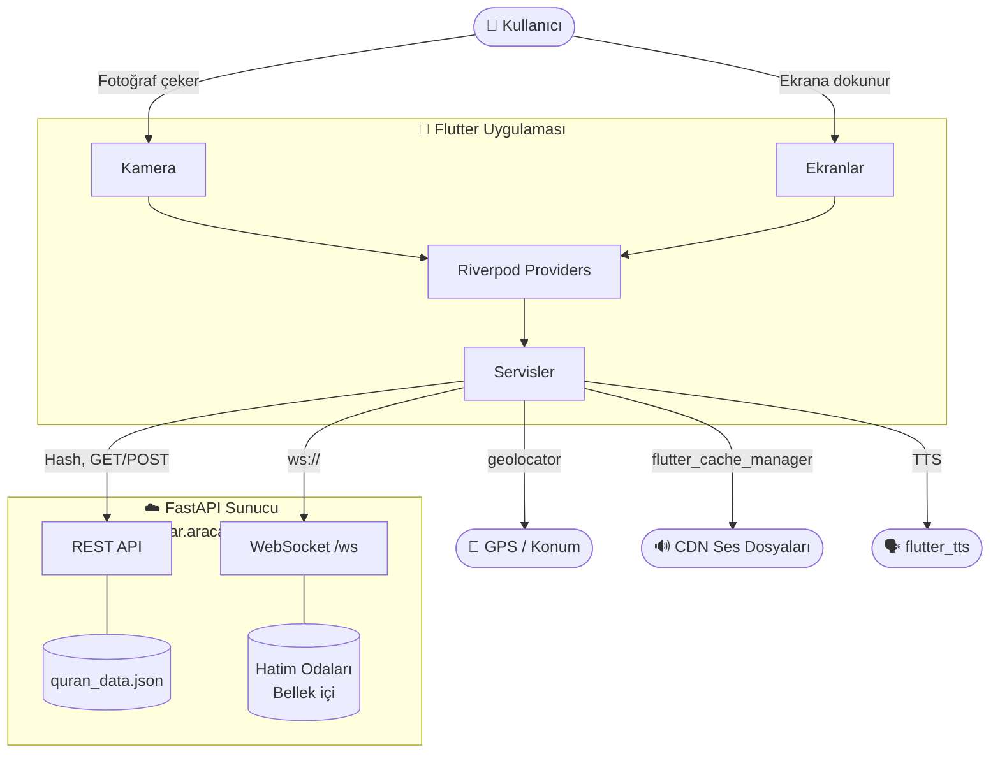
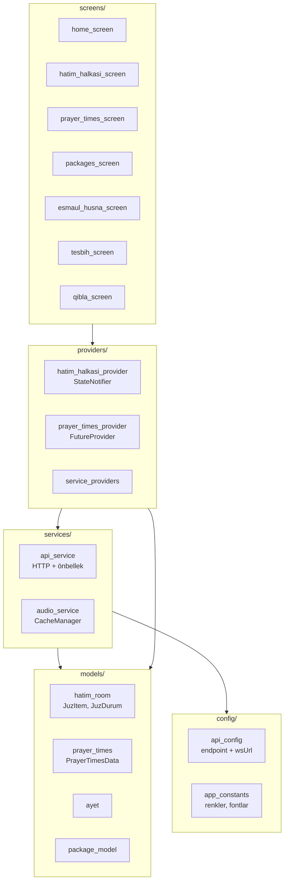
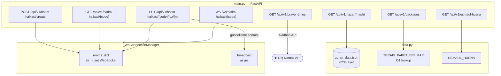
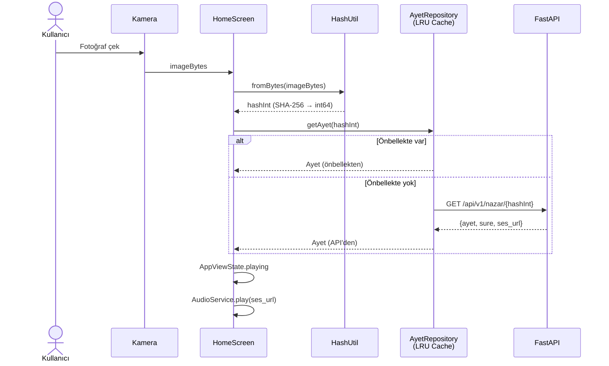
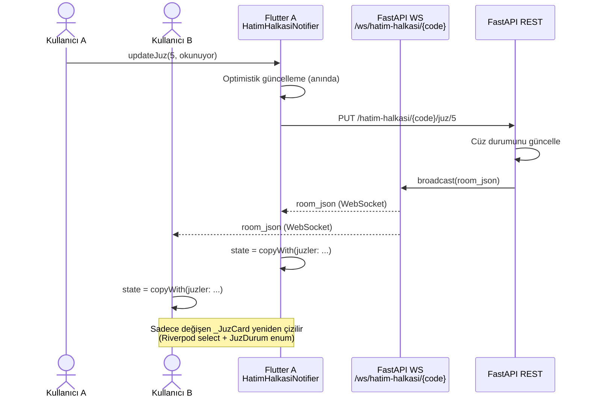
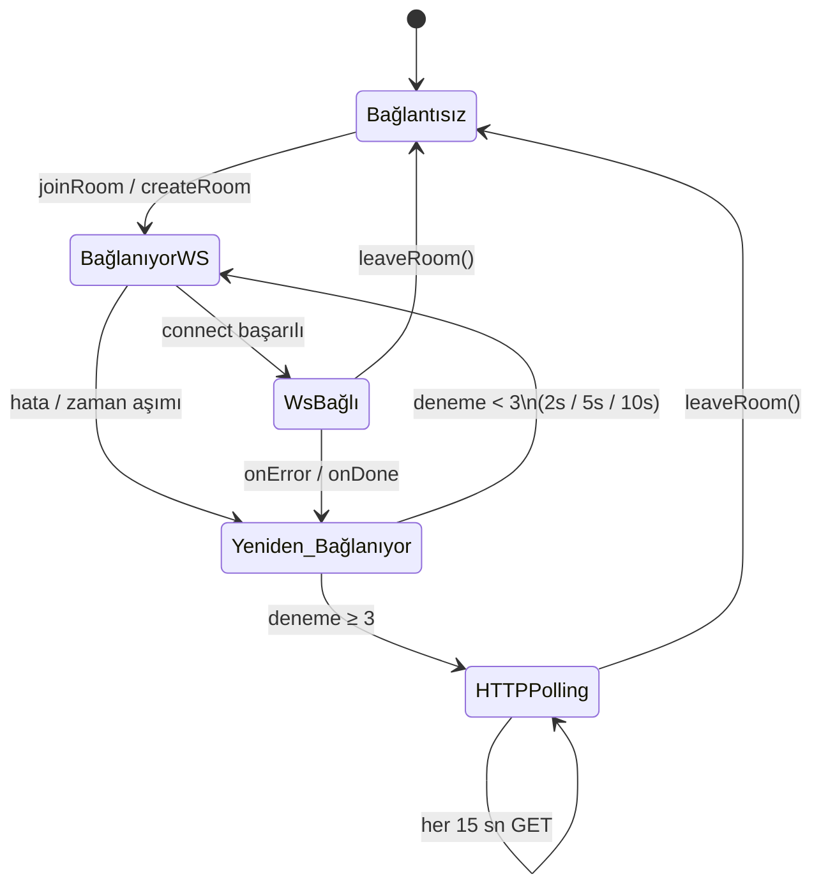
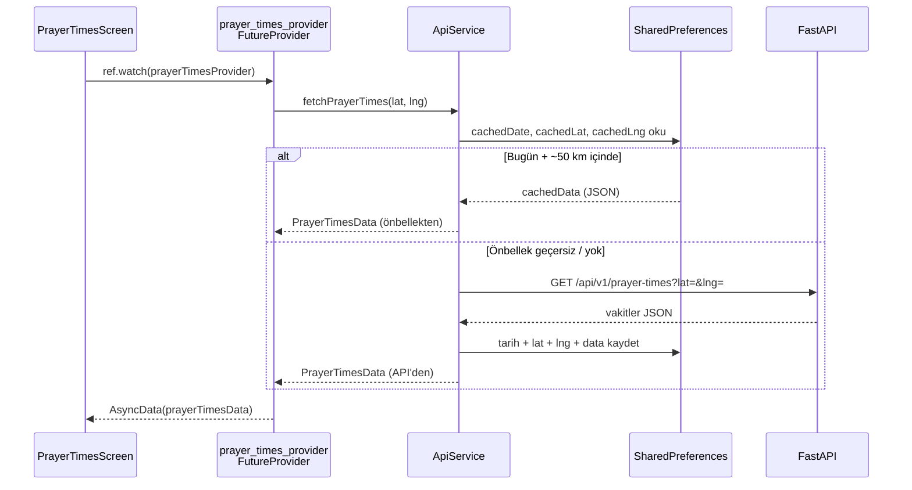
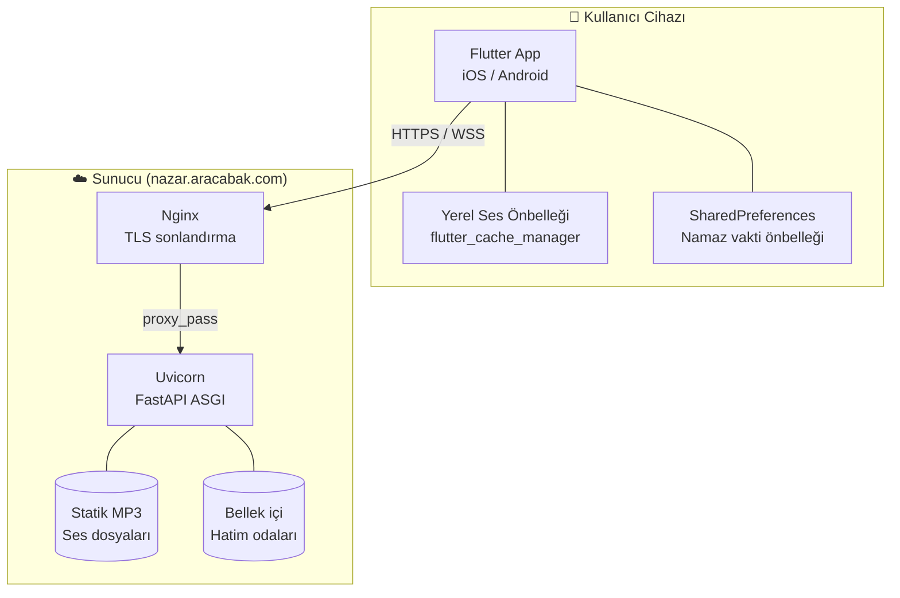

# Nazar & Ferahlama

> Kamera ile yüz analizi yapan, SHA-256 hash üzerinden Kuran ayeti seçen, sesli okuyan ve toplu Kuran hatmi için gerçek zamanlı oda sistemi sunan Flutter mobil uygulaması.

[](https://flutter.dev)
[](https://fastapi.tiangolo.com)
[](https://python.org)

---

## İçindekiler

1. [Giriş ve Hedefler](#1-giriş-ve-hedefler)
2. [Kısıtlar](#2-kısıtlar)
3. [Bağlam ve Kapsam](#3-bağlam-ve-kapsam)
4. [Çözüm Stratejisi](#4-çözüm-stratejisi)
5. [Yapı Görünümü](#5-yapı-görünümü)
6. [Çalışma Zamanı Görünümü](#6-çalışma-zamanı-görünümü)
7. [Dağıtım Görünümü](#7-dağıtım-görünümü)
8. [Çapraz Kesim Kavramları](#8-çapraz-kesim-kavramları)
9. [Mimari Kararlar (ADR)](#9-mimari-kararlar-adr)
10. [Kalite Gereksinimleri](#10-kalite-gereksinimleri)
11. [Riskler ve Teknik Borç](#11-riskler-ve-teknik-borç)
12. [Sözlük](#12-sözlük)
13. [Kurulum ve Çalıştırma](#kurulum-ve-çalıştırma)

---

## 1. Giriş ve Hedefler

### Amaç

Nazar & Ferahlama, kullanıcının kameradan fotoğraf çekerek SHA-256 hash değeri üzerinden deterministik bir Kuran ayeti almasını ve ayeti sesli dinlemesini sağlar. Ek olarak:

- **Hatim Halkası**: Birden fazla kullanıcının 30 cüzü paylaşarak gerçek zamanlı hatim tamamlaması
- **Namaz Vakitleri**: GPS konumuna göre günlük namaz vakitleri ve kıble yönü
- **Terapi Paketleri**: Ses tabanlı manevi terapi içerikleri
- **Esmaü'l Hüsna**: Allah'ın 99 ismini sesli dinleme

### Özellik Tablosu

| Özellik | Açıklama | Durum |
|---|---|---|
| Nazar Analizi | Kamera → SHA-256 → Ayet + Ses | ✅ |
| Hatim Halkası | WebSocket tabanlı canlı oda sistemi | ✅ |
| Namaz Vakitleri | GPS + günlük önbellek + kıble pusulası | ✅ |
| Terapi Paketleri | Ses paketleri, kategori filtreleme | ✅ |
| Esmaü'l Hüsna | 99 isim, sesli okuma | ✅ |
| Tesbih | Dijital tesbih sayacı | ✅ |

---

## 2. Kısıtlar

| Kategori | Kısıt |
|---|---|
| **Platform** | iOS 14+ ve Android 8+ (API 21+) |
| **Dil** | Flutter/Dart (mobil), Python 3.11+ (backend) |
| **Kimlik doğrulama** | API Key (dart-define ile enjekte, başlıkta taşınır) |
| **Gizlilik** | Fotoğraf veya kişisel veri backend'e gönderilmez, sadece hash |
| **Çevrimdışı** | İnternet gerektiren özellikler (Ayet, Hatim) ağ olmadan çalışmaz |
| **Ses** | MP3 dosyaları CDN/backend'de barındırılır, yerel önbellek kullanılır |

---

## 3. Bağlam ve Kapsam

### Sistem Bağlam Diyagramı



### Dış Sistemler

| Sistem | Etkileşim |
|---|---|
| **FastAPI Backend** | REST + WebSocket; ayet, namaz vakti, hatim odası verileri |
| **GPS / Geolocator** | Namaz vakitleri için konum; cihaz API'si |
| **CDN Ses** | MP3 Kuran tilavetleri; HTTP, yerel önbellek |
| **flutter_tts** | Ayet metninin yerel TTS ile seslendirilmesi |
| **sensors_plus** | Manyetometre + ivmeölçer; kıble pusulası |

---

## 4. Çözüm Stratejisi

| Karar | Seçilen Yaklaşım | Gerekçe |
|---|---|---|
| State yönetimi | Riverpod `StateNotifier` + `select()` | Granüler rebuild kontrolü |
| Gerçek zamanlı | WebSocket öncelikli, HTTP polling yedek | Düşük gecikme + kötü ağ toleransı |
| Hash algoritması | SHA-256 → ilk 8 bayt → int64 | Deterministik, geri döndürülemez |
| Namaz vakti cache | SharedPreferences + tarih + ~50 km tolerans | Seyahat tespiti |
| Ses önbelleği | flutter_cache_manager (30 gün, 300 dosya) | Veri tasarrufu |
| LRU ayet cache | LinkedHashMap, 50 giriş | Tekrar eden hash'lerde API çağrısı yok |
| Optimistik güncelleme | Hatim cüz durumu anında değişir, hata durumunda geri alınır | Algılanan hız |

---

## 5. Yapı Görünümü

### Flutter Bileşen Diyagramı



### Backend Bileşen Diyagramı



### Klasör Yapısı

```
nazar_app/
├── main.py                     # FastAPI uygulama
├── data.py                     # Statik veri + TERAPI_PAKETLERI_MAP
├── build_db.py                 # quran_data.json üretici
├── requirements.txt
├── tests/                      # pytest test süiti
├── .github/workflows/          # CI/CD
└── mobile/
    └── lib/
        ├── config/             # api_config.dart, app_constants.dart, theme.dart
        ├── core/               # logger.dart
        ├── models/             # ayet, hatim_room, prayer_times, package_model
        ├── providers/          # hatim_halkasi_provider, prayer_times_provider, service_providers
        ├── screens/            # Her özellik için bir ekran
        ├── services/           # api_service, audio_service
        ├── utils/              # hash_util.dart
        └── widgets/
            ├── painters/       # CustomPainter sınıfları
            ├── camera_frame_widget.dart
            ├── result_panel_widget.dart
            ├── tesbih_widget.dart
            └── analyzing_indicator.dart
```

---

## 6. Çalışma Zamanı Görünümü

### Nazar Analizi Akışı



### Hatim Halkası — WebSocket Gerçek Zamanlı Güncelleme



### WebSocket Bağlantı Durum Makinesi



### Namaz Vakitleri — Günlük Önbellek Akışı



---

## 7. Dağıtım Görünümü



### API Uç Noktaları

| Metot | Yol | Açıklama |
|---|---|---|
| `GET` | `/api/v1/nazar/{hash}` | Hash'e göre ayet getir |
| `GET` | `/api/v1/prayer-times?lat=&lng=` | Namaz vakitleri |
| `GET` | `/api/v1/packages` | Terapi paket listesi |
| `GET` | `/api/v1/packages/{id}` | Paket detayı |
| `GET` | `/api/v1/esmaul-husna` | 99 isim listesi |
| `POST` | `/api/v1/hatim-halkasi/create` | Yeni hatim odası oluştur |
| `GET` | `/api/v1/hatim-halkasi/{code}` | Oda durumu |
| `PUT` | `/api/v1/hatim-halkasi/{code}/juz/{n}` | Cüz durumu güncelle |
| `WS` | `/ws/hatim-halkasi/{code}` | Gerçek zamanlı oda sync |

---

## 8. Çapraz Kesim Kavramları

### Güvenlik

- API Key `X-API-Key` başlığı ile taşınır (dart-define ile enjekte, kaynak kodda bulunmaz)
- WebSocket bağlantılarında API Key sorgu parametresi olarak iletilir (`?api_key=...`)
- Fotoğraf backend'e asla gönderilmez; sadece hash değeri iletilir

### Hata Yönetimi

- `ApiService`: 3 deneme, exponential backoff (1s, 2s, 4s), kullanıcı dostu Türkçe hata mesajları
- `HatimHalkasiNotifier`: WS hataları → yeniden bağlantı → HTTP polling yedek
- `updateJuz`: optimistik güncelleme + API hatasında `refresh()` ile geri alma

### Önbellekleme Katmanları

| Katman | Mekanizma | TTL / Boyut |
|---|---|---|
| Ayet LRU | `LinkedHashMap` (AyetRepository) | 50 giriş |
| Ses dosyaları | flutter_cache_manager | 30 gün, 300 dosya |
| Namaz vakitleri | SharedPreferences | Günlük + ~50 km |

### Test Stratejisi

- **Backend**: pytest + httpx TestClient; her endpoint için birim testleri
- **Flutter**: `flutter_test` + `mocktail`; `HatimHalkasiNotifier` WS enjeksiyonu ile test edilir
- **Hatim Provider**: `wsConnect: null` ile HTTP polling modunda test

---

## 9. Mimari Kararlar (ADR)

### ADR-001: SHA-256 Hash ile Deterministik Ayet Seçimi

**Durum**: Kabul edildi

**Bağlam**: Kullanıcının çektiği fotoğraftan bir Kuran ayeti seçilmeli.

**Karar**: `SHA-256(imageBytes)` → ilk 8 bayt → `int64` → `abs() % 6236`

**Sonuçlar**:
- ✅ Aynı fotoğraf her zaman aynı ayeti verir
- ✅ Fotoğraf sunucuya gönderilmez (gizlilik)
- ⚠️ Farklı fotoğraflar çakışabilir (kasıtlı, zararsız)

---

### ADR-002: Riverpod `select()` ile Granüler Rebuild

**Durum**: Kabul edildi

**Bağlam**: Hatim Halkası ekranında 30 cüz kartı var; bir cüzün durumu değişince tüm liste yeniden çizilmemeli.

**Karar**: `_JuzCard` bileşeni `ref.watch(hatimHalkasiProvider.select((s) => s.juzler.firstWhere(...).durum))` kullanır. `JuzDurum` bir `enum` olduğu için Riverpod kimlik eşitliği yapabilir.

**Sonuçlar**:
- ✅ Sadece değişen kart yeniden çizilir
- ✅ `JuzItem` sınıfına `==` override gerekmez
- ⚠️ `firstWhere` fırlatabilir — oda verisi tutarlı olduğu sürece sorun yok

---

### ADR-003: WebSocket Öncelikli, HTTP Polling Yedek

**Durum**: Kabul edildi

**Bağlam**: Hatim Halkası için gerçek zamanlı güncelleme gerekli; bazı ağlarda WebSocket çalışmayabilir.

**Karar**: WS bağlantısı 3 kez yeniden denenirse (2s / 5s / 10s backoff) HTTP polling'e geçilir (15 sn).

**Sonuçlar**:
- ✅ Kötü ağ koşullarında uygulama çalışmaya devam eder
- ✅ `wsConnect` injectable olduğu için testler WS olmadan çalışır
- ⚠️ Bellek içi WS odaları — sunucu yeniden başlatılırsa bağlantılar düşer

---

### ADR-004: Fotoğraf Gizliliği

**Durum**: Kabul edildi

**Bağlam**: Kullanıcı kameradan fotoğraf çekiyor; gizlilik önemli.

**Karar**: Yalnızca SHA-256 hash (bir integer) sunucuya gönderilir. Görüntü verisi cihazda kalır ve işlem sonrası silinir.

**Sonuçlar**:
- ✅ Sıfır görüntü veri sızıntısı riski
- ✅ KVKK / GDPR açısından güvenli tasarım
- ✅ Küçük ağ yükü (tam URL parametresi)

---

### ADR-005: Dart-Define ile Yapılandırma Enjeksiyonu

**Durum**: Kabul edildi

**Bağlam**: API key ve base URL platform başına farklılık gösterebilir; kaynak kodda bulunmamalı.

**Karar**: `--dart-define-from-file=dart_defines.json` ile derleme zamanında enjeksiyon. `dart_defines.json` git-ignore'da.

**Sonuçlar**:
- ✅ Kaynak kodda sır yok
- ✅ CI/CD'de environment variable ile override edilebilir
- ⚠️ Ekip üyelerinin `dart_defines.json`'ı manuel oluşturması gerekir

---

### ADR-006: Bellek İçi Hatim Odaları

**Durum**: Kabul edildi (kısa vadeli)

**Bağlam**: Hatim Halkası MVP için hızlı geliştirme gerekiyor.

**Karar**: Oda verisi FastAPI process belleğinde tutulur (`dict[str, HatimRoom]`).

**Sonuçlar**:
- ✅ Sıfır veritabanı bağımlılığı, hızlı geliştirme
- ⚠️ Sunucu yeniden başlatılırsa tüm oda verileri silinir
- ⚠️ Yatay ölçekleme mümkün değil
- 📋 Gelecek: Redis veya PostgreSQL ile kalıcı depolama

---

## 10. Kalite Gereksinimleri

| Kalite Hedefi | Senaryo | Önlem |
|---|---|---|
| **Performans** | 30 kart, 1 güncelleme → sadece 1 kart çizilir | Riverpod `select()` + `JuzDurum` enum |
| **Güvenilirlik** | WS bağlantısı kesilir → uygulama çalışmaya devam eder | Yeniden bağlantı + HTTP polling yedek |
| **Gizlilik** | Fotoğraf hiçbir zaman sunucuya gönderilmez | SHA-256 hash mimarisi |
| **Veri Tasarrufu** | Aynı ses dosyası tekrar indirilmez | flutter_cache_manager (30 gün TTL) |
| **Ağ Verimliliği** | Namaz vakitleri günde 1 kez çekilir | SharedPreferences günlük cache |
| **Test Edilebilirlik** | WS notifier birim testlerle doğrulanabilir | Injectable `wsConnect` factory |

---

## 11. Riskler ve Teknik Borç

| Risk / Borç | Etki | Azaltma |
|---|---|---|
| Bellek içi hatim odaları | Sunucu restart'ta veri kaybı | Redis/PostgreSQL ile kalıcı depolama |
| WebSocket yatay ölçekleme | Çok sunucu → farklı bağlantılar mesaj almaz | Redis Pub/Sub ile çözülebilir |
| Aladhan namaz vakti API bağımlılığı | Dış API çöküşü → namaz vakti yok | Yerel hesaplama yedek (adhan-dart) |
| Tek process WS yönetimi | Yüksek eş zamanlılıkta bottleneck | asyncio + connection limiti |

---

## 12. Sözlük

| Terim | Açıklama |
|---|---|
| **Ayet** | Kuran'dan bir ayet (6236 ayet indeksli) |
| **Hatim** | Kuran'ın tamamının okunması (30 cüz) |
| **Hatim Halkası** | Birden fazla kişinin cüzleri paylaşarak yaptığı hatim |
| **Cüz** | Kuran'ın 30 eşit bölümünden biri |
| **JuzDurum** | `bos` / `okunuyor` / `tamamlandi` enum değerleri |
| **Nazar** | Kötü göz; uygulamanın nazar okuma özelliği |
| **kıble** | Namaz kılınırken yönelinen Mekke yönü |
| **Esmaü'l Hüsna** | Allah'ın 99 ismi |
| **dart-define** | Flutter derleme zamanı ortam değişkeni enjeksiyonu |
| **LRU** | Least Recently Used — en az kullanılan öğe çıkarılır |
| **ADR** | Architecture Decision Record — mimari karar kaydı |

---

## Kurulum ve Çalıştırma

### Backend

```bash
# Bağımlılıkları yükle
pip install -r requirements.txt

# Kuran veritabanını oluştur (bir kez)
python build_db.py

# Geliştirme sunucusunu başlat
uvicorn main:app --host 0.0.0.0 --port 8000 --reload
```

### Mobil

```bash
# Yapılandırma dosyasını oluştur
cp mobile/dart_defines.example.json mobile/dart_defines.json
# dart_defines.json içine API_KEY ve API_BASE_URL gir

# Bağımlılıkları yükle
cd mobile && flutter pub get

# Geliştirme modunda çalıştır
flutter run --dart-define-from-file=dart_defines.json

# veya Makefile ile (proje kökünden)
make run
```

### Testler

```bash
# Backend testleri
pytest tests/ -v

# Flutter testleri
cd mobile && flutter test

# Statik analiz
cd mobile && flutter analyze
```

### Dağıtım

```bash
# iOS (App Store Connect)
cd mobile
APPLE_ID=... APP_SPECIFIC_PASS=... ./deploy.sh <build_no>

# Android APK
make build-apk

# iOS IPA
make build-ipa
```

---

*Bu doküman [ARC42](https://arc42.org) şablonu kullanılarak hazırlanmıştır.*
